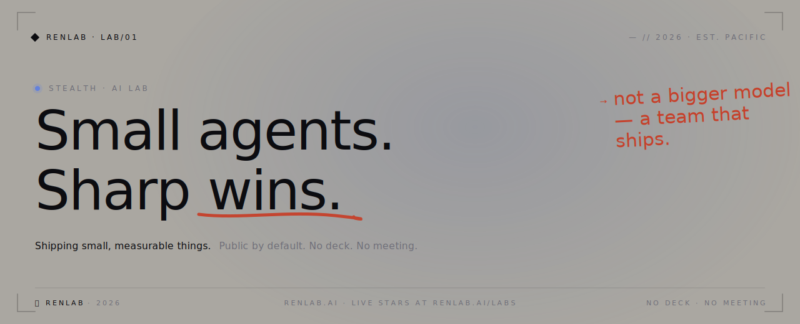

 

&nbsp;

&nbsp;

 

---

## `// what we're shipping`

<table>
  <tr>
    <td><code>01</code></td>
    <td><b><a href="https://github.com/Veinsure/Stagent">Stagent</a></b> AI game live-streaming platform</td>
    <td align="right"></td>
  </tr>
  <tr>
    <td><code>02</code></td>
    <td><b><a href="https://github.com/Upp-renlab/Cairn">Cairn</a></b> <i>— (summary coming)</i></td>
    <td align="right"></td>
  </tr>
  <tr>
    <td><code>03</code></td>
    <td><b><a href="https://github.com/chenjr-renlab-ai/goalcast">goalcast</a></b> <i>— (summary coming)</i></td>
    <td align="right"></td>
  </tr>
  <tr>
    <td><code>04</code></td>
    <td><b><a href="https://github.com/libz2026/TeamBrain">TeamBrain</a></b> <i>— (summary coming)</i></td>
    <td align="right"></td>
  </tr>
  <tr>
    <td><code>05</code></td>
    <td><b><a href="https://github.com/LiuShiyuMath/front-simple-screen-monitor">front-simple-screen-monitor</a></b> <i>— (summary coming)</i></td>
    <td align="right"></td>
  </tr>
</table>

> `→` live star growth + 7-day leaderboard at **[renlab.ai/labs](https://renlab.ai/labs)**

 

## `// the team`

&nbsp;
&nbsp;
&nbsp;
&nbsp;
&nbsp;

 

## `// conventions`

- New hires pick a GitHub handle shaped like `<name>-renlab-ai`.
- New repos land directly in [`renlabai/`](https://github.com/renlabai) — not personal accounts.
- Every project is public by default. Private needs a reason.
- Ship small. Measure. Ship again.

 

---

<code>⏤ RENLAB · 2026 · EST. PACIFIC</code> &nbsp;·&nbsp; <a href="mailto:anzy@renlab.ai">anzy@renlab.ai</a> &nbsp;·&nbsp; <a href="https://renlab.ai">renlab.ai</a> &nbsp;·&nbsp; no deck · no meeting

